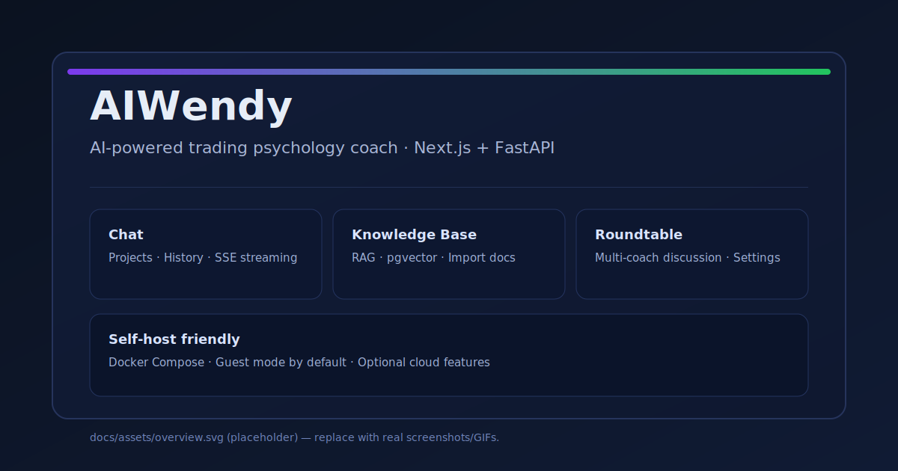
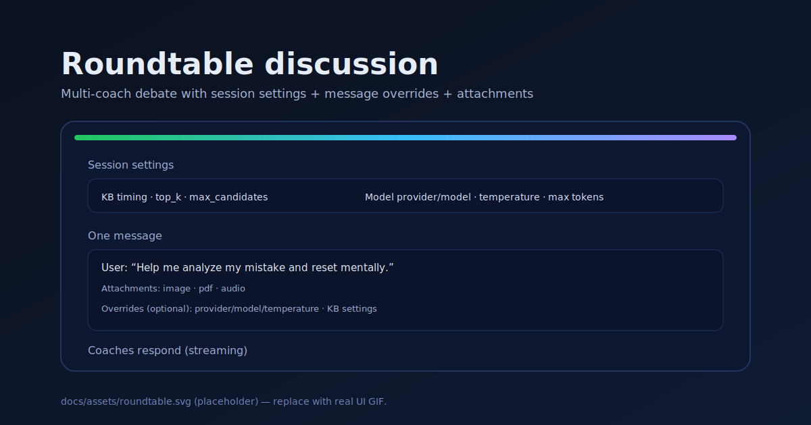
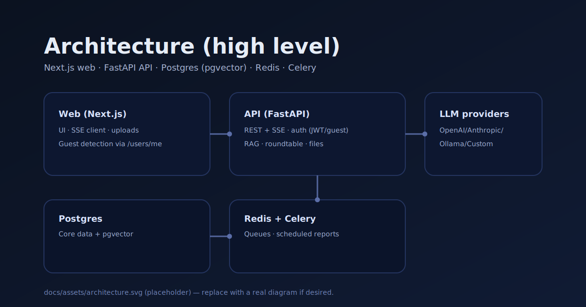

# AIWendy

[English](README.md) | [简体中文](README.zh-CN.md)

[](https://github.com/fretelli/AIWendy/actions/workflows/ci.yml)
[](LICENSE)

AIWendy is an AI-powered performance coach for trading psychology (Web: Next.js, API: FastAPI). It’s built around chat, knowledge base (RAG), and a “roundtable” multi-coach discussion mode.

Disclaimer: for educational/research purposes only. This project is **not** investment advice.

## Screenshots







## What you can do

- **Chat + projects**: organize conversations per project, keep history, stream responses (SSE)
- **Roundtable discussion**: multiple AI coaches discuss one question with configurable session/message settings
- **Knowledge base (RAG)**: import docs, semantic search (pgvector), inject context by timing
- **Attachments**: upload images/docs/audio (extract/transcribe where supported)
- **Journaling + reports**: trading journal, analytics, scheduled reports (Celery)
- **Journal import (CSV/XLSX)**: upload a file and map columns in the UI (works with different broker/export formats)
- **Self-hosted by default**: Docker Compose; optional cloud/SaaS mode via env flags

## Quick start (self-host)

```bash
cd aiwendy
Copy-Item .env.example .env   # PowerShell (or: cp .env.example .env)
docker compose up -d --build
```

- Web: `http://localhost:3000`
- API health: `http://localhost:8000/api/health`
- API docs: `http://localhost:8000/docs`

Full guide: `aiwendy/docs/SELF_HOSTING.md`

## Guest mode (no login)

Set `AIWENDY_AUTH_REQUIRED=0` for the API (enabled by default in `aiwendy/docker-compose.yml`) to use the app without logging in.

## Roadmap (community)

- Add more “1-click demo” options (cloud deploy templates)
- Improve preset library and import/export
- More evaluators/benchmarks for coaching quality

## Docs

- Start here: `docs/README.md`
- Repo map: `docs/PROJECT_OVERVIEW.md`
- App docs: `aiwendy/docs/README.md`
- Architecture: `aiwendy/docs/ARCHITECTURE.md`
- Deployment: `aiwendy/docs/DEPLOYMENT.md`

## Contributing & security

- Contributing: `CONTRIBUTING.md`
- Code of Conduct: `CODE_OF_CONDUCT.md`
- Security policy: `SECURITY.md`

## Deployment modes (open core)

AIWendy supports two modes:

- **Self-hosted (default)**: open-source community edition
- **Cloud/SaaS**: multi-tenancy, billing, enterprise SSO, analytics (activated only when `DEPLOYMENT_MODE=cloud`)

See `docs/DEPLOYMENT_MODES.md` for details.
