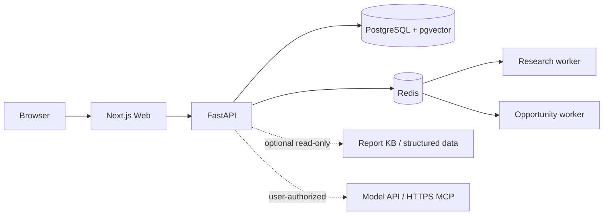

# KeelTrader

[](https://github.com/fretelli/KeelTrader/actions/workflows/ci.yml)
[](https://github.com/fretelli/KeelTrader/actions/workflows/security.yml)
[](https://github.com/fretelli/KeelTrader/releases)
[](LICENSE)

[中文说明](README.zh-CN.md)

KeelTrader is a self-hosted investment research operating system and wealth-management workspace for individuals and small teams. AgentOS combines portfolio evidence, allocation, holdings, markets, opportunities, decisions, research, and an agent workspace in one persistent desktop.

KeelTrader is deliberately vertical. It includes a research agent that can use approved research tools, BYOK model credentials, public HTTPS MCP servers, budgets, memory, and scheduled research. It is not a general computer-use agent or a replacement for Codex, Claude Code, Hermes, or OpenClaw.

## What it provides

- Eight coordinated AgentOS modules: Overview, Allocation, Holdings, Market, Opportunities, Decisions, Research, and Agent Workspace.
- Market is organized as exactly two top-level views—Market/Sectors/Flows and Macro Data—with rates, futures, options, valuation, correlation, and factors kept as in-module drilldowns.
- Interactive valuation v2, 20–252 day correlation, and factor/crowding endpoints read immutable Tushare-published snapshots; each market or macro history range is scoped to its visible drilldown instead of a module-wide hidden control, while valuation bubbles and ranking rows open a 1M–5Y point-in-time view with PE/PB, percentiles, crowding coverage, auditable constituents, and an active-account held-industry filter without request-time source scans. Expected broad-index coverage is explicit instead of being inferred from history length. Macro v2 uses professional headline series, preserves the rates/yields group, exposes official subseries in drilldown, and labels stale histories without hiding them. Structured Tushare datasets take priority; whitelisted `eco_cal` releases require coverage, revision, and freshness disclosure, and missing domains remain explicitly unavailable without synthetic substitutes.
- Macro navigation returns lightweight official-field summaries, while each selected GDP/CPI/PPI/M2/social-financing/PMI/rate series lazily loads primary, MoM, YoY, and rolling 10-year percentile histories with explicit official/calculated/not-applicable methodology.
- Manual and CSV portfolio ingestion, immutable transactions, dated manual prices, explicit valuation completeness, and NAV history.
- Market evidence, report search, shareholder research, consensus snapshots, and Tushare-backed strategy experiments.
- Versioned hypotheses and decisions with evidence, falsification conditions, review dates, and attribution.
- An optional, disabled-by-default content-brief sink can submit an exact hypothesis version to an operator-configured editorial system without granting artifact, approval, or delivery permissions.
- Immutable bilingual research versions with real Chinese and English downloadable PDFs.
- A persistent Research Agent dock with resumable runs and human approval boundaries.
- Encrypted per-user BYOK credentials and explicitly authorized MCP tools.
- Immutable releases with container digests, SBOMs, provenance, and signatures.

KeelTrader does not place or cancel orders, connect to exchanges, execute arbitrary code, or promise investment returns. Historical database migrations remain so existing installations can upgrade safely.

## Architecture


```mermaid
flowchart LR
  U[Browser] --> W[Next.js Web]
  W --> A[FastAPI]
  A --> P[(PostgreSQL + pgvector)]
  A --> R[(Redis)]
  R --> RW[Research worker]
  R --> OW[Opportunity worker]
  A -. optional read-only .-> D[Report KB / structured data]
  A -. user-authorized .-> M[Model API / HTTPS MCP]
```

- `keeltrader/apps/web/`: Next.js App Router frontend.
- `keeltrader/apps/api/`: FastAPI API and research services.
- AgentOS web routes live under `/agent`; its authenticated API is mounted under `/api/v1/agent`.
- Read-only capability discovery is available at `GET /api/v1/markets/capabilities`; valuation history uses `GET /api/v1/markets/valuation/history` and reports `available_points_total` independently of the requested range so clients can show honest backfill progress; private held-industry mapping uses `GET /api/v1/markets/valuation/held-industries`; macro summaries remain on `/api/v1/markets/macro/series`; portfolio evidence lives under `/api/v1/agent/portfolio/accounts/{id}`.
- `domain/agentos` owns portfolio, hypothesis, decision, strategy, consensus, and document-version records.
- PostgreSQL owns application state; Alembic is the only schema-management path.
- Redis provides cache, task queues, coordination, and worker heartbeats.
- Dedicated workers execute resumable research and materialize opportunity snapshots.
- Content-brief sink credentials and workspace mappings are deployment-owned; the open-source defaults make no external write.

AgentOS never connects to a broker or executes orders. Missing prices, FX rates, or source data remain explicit unavailable/incomplete states; production does not synthesize portfolio values. Schema upgrades are additive, and historical migrations remain immutable.

See [Architecture](keeltrader/docs/ARCHITECTURE.md) for boundaries and data flow.

## Quick start

Requirements: Docker Engine with Compose, 4 GB RAM minimum, and free ports 3000 and 8000.

```bash
cd keeltrader
cp .env.example .env
# Replace every required secret in .env.
docker compose -f docker-compose.selfhost.yml up -d --build
```

The API container runs Alembic migrations by default in the portable self-host stack. Check readiness at `http://127.0.0.1:8000/health/ready` and open `http://localhost:3000`.

## Documentation

- [Self-hosting](keeltrader/docs/SELF_HOSTING.md)
- [Deployment](keeltrader/docs/DEPLOYMENT.md)
- [Compatibility](keeltrader/docs/COMPATIBILITY.md)
- [Custom model APIs](keeltrader/docs/CUSTOM_API_SETUP.md)
- [Release and supply chain](keeltrader/docs/RELEASING.md)
- [Security policy](SECURITY.md)
- [Contributing](CONTRIBUTING.md)

## Security

Authentication is enabled by default. Model credentials are encrypted and excluded from logs, task events, memory, and tool arguments. User MCP endpoints are restricted to public HTTPS and require tool approval. Production operators should pin release image digests in a private infrastructure repository.

Report vulnerabilities privately as described in [SECURITY.md](SECURITY.md).

## License and disclaimer

Apache-2.0. KeelTrader is research software, not investment advice. Models and data sources can be incomplete or wrong; final decisions remain with the user.
