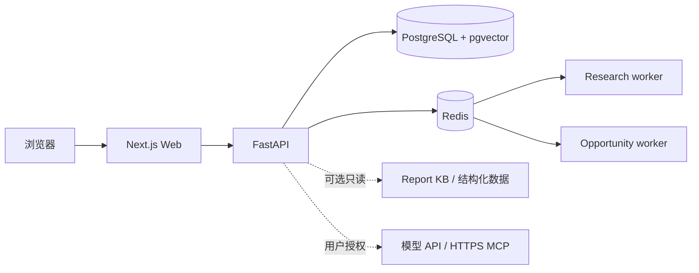

# KeelTrader

[](https://github.com/fretelli/KeelTrader/actions/workflows/ci.yml)
[](https://github.com/fretelli/KeelTrader/actions/workflows/security.yml)
[](LICENSE)

[English](README.md)

KeelTrader 是面向个人与小型团队的自托管投研与财富管理操作系统。AgentOS 将组合证据、资产配置、持仓、市场、机会、决策、研究和 Agent 工作区整合进一个持续存在的桌面。

KeelTrader 是垂直投研产品：研究 Agent 只能使用获准的研究工具、用户自带模型凭证、公开 HTTPS MCP、预算、记忆和定时研究。它不是通用电脑操作 Agent，也不替代 Codex、Claude Code、Hermes 或 OpenClaw。

## 核心能力

- 八个协同模块：总览、资产配置、持仓、市场、机会、决策、研报、Agent 工作区。
- 市场模块只保留“大盘 · 行业 · 资金流”和“宏观数据”两个一级视图；估值气泡与排序行可下钻 1M–5Y 点时 PE/PB、历史分位、拥挤覆盖和可审计成分，“我的持仓行业”只映射活跃账户的非零 A 股持仓。
- 手工与 CSV 组合录入、不可变交易、日期化手工价格、明确的估值完整性和 NAV 历史。
- 市场证据、研报搜索、股东研究、共识快照与真实 Tushare 数据驱动的策略实验。
- 带证据、证伪条件、复核日期和归因的版本化假设与决策。
- 不可变的中英文研究版本，以及真实可下载的中英文 PDF。
- 持续存在的研究 Agent Dock、可恢复任务和人工审批边界。
- 每用户加密 BYOK 凭证和显式授权的 MCP 工具。

KeelTrader 不连接券商、不下单或撤单、不执行任意代码，也不承诺投资收益。缺失价格、汇率或源数据会明确显示为不可用或不完整，生产环境不会合成组合数值。

## 架构



- `keeltrader/apps/web/`：Next.js App Router 前端；AgentOS 页面位于 `/agent`。
- `keeltrader/apps/api/`：FastAPI 与研究服务；AgentOS API 位于 `/api/v1/agent`。
- `domain/agentos`：组合、假设、决策、策略、共识和文档版本模型。
- PostgreSQL 保存应用状态，Alembic 是唯一数据库结构变更路径。
- Redis 提供缓存、任务队列、协同与 Worker 心跳。
- 数据库迁移只做增量升级，历史迁移保持不可变。

详细边界和数据流见 [架构文档](keeltrader/docs/ARCHITECTURE.md)。

## 快速开始

要求：Docker Engine 与 Compose、至少 4 GB 内存，以及空闲的 3000 和 8000 端口。

```bash
cd keeltrader
cp .env.example .env
# 替换 .env 中所有必需的密钥。
docker compose -f docker-compose.selfhost.yml up -d --build
```

便携自托管栈默认由 API 容器执行 Alembic 迁移。通过 `http://127.0.0.1:8000/health/ready` 检查就绪状态，再打开 `http://localhost:3000`。

## 文档

- [自托管](keeltrader/docs/SELF_HOSTING.md)
- [部署](keeltrader/docs/DEPLOYMENT.md)
- [兼容性](keeltrader/docs/COMPATIBILITY.md)
- [自定义模型 API](keeltrader/docs/CUSTOM_API_SETUP.md)
- [发布与供应链](keeltrader/docs/RELEASING.md)
- [安全策略](SECURITY.md)
- [贡献指南](CONTRIBUTING.md)

## 安全与许可

默认启用身份认证。模型凭证经过加密，不进入日志、任务事件、记忆或工具参数。用户 MCP 端点仅允许公开 HTTPS，并要求工具审批。生产运维方应在私有基础设施仓库固定发布镜像 digest。

Apache-2.0。KeelTrader 是研究软件，不构成投资建议；模型和数据源可能不完整或出错，最终决策由用户负责。
