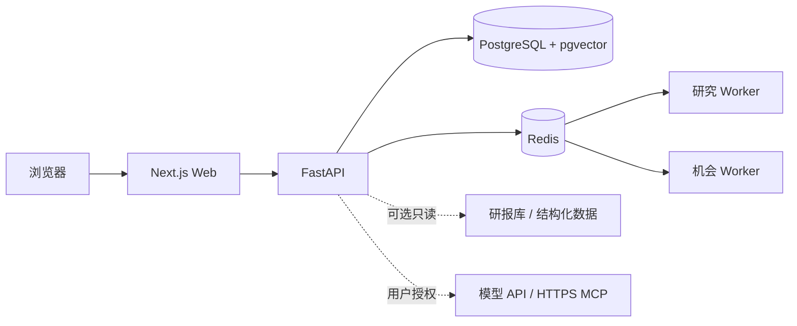

# KeelTrader

[English](README.md)

KeelTrader 是面向个人与小团队的自托管投资研究操作系统。它把市场证据、研报检索、股东研究、家庭资产配置、持续研究任务和投资假设复盘集中到一个网页工作区。

KeelTrader 是垂直研究产品。内置 Research Agent 可以使用经过授权的研究工具、用户自己的模型密钥、公开 HTTPS MCP、预算、记忆和定时研究，但它不是通用电脑操作 Agent，也不替代 Codex、Claude Code、Hermes 或 OpenClaw。

## 核心能力

- 可恢复、有人类审批边界的统一 Research Agent 工作区。
- 覆盖资金、宏观、利率、期货和期权的市场工作区。
- 将证据固化为可审查研究快照的机会中心。
- 公司档案、股东雷达、研报知识库搜索和假设验证。
- 家庭财富、SAA/TAA 与受约束配置研究。
- 加密的用户 BYOK 凭据和显式授权的 MCP 工具。
- 带镜像 digest、SBOM、provenance 和签名的不可变发布。

KeelTrader 不下单、不撤单、不连接交易所、不执行任意代码，也不承诺投资收益。历史数据库迁移会继续保留，确保已有部署可以安全升级。

## 架构



- `keeltrader/apps/web/`：Next.js App Router 前端。
- `keeltrader/apps/api/`：FastAPI API 与研究服务。
- PostgreSQL 保存应用状态；Alembic 是唯一数据库结构管理入口。
- Redis 提供缓存、任务队列、协调和 Worker 心跳。
- 专用 Worker 执行可恢复研究任务并物化机会快照。

## 快速开始

需要 Docker Engine 与 Compose、至少 4 GB 内存，以及空闲的 3000 和 8000 端口。

```bash
cd keeltrader
cp .env.example .env
# 替换 .env 中全部必填密钥。
docker compose -f docker-compose.selfhost.yml up -d --build
```

便携自托管编排中的 API 默认运行 Alembic 迁移。就绪检查地址为 `http://127.0.0.1:8000/health/ready`，网页地址为 `http://localhost:3000`。

更多内容见 [自托管](keeltrader/docs/SELF_HOSTING.md)、[架构](keeltrader/docs/ARCHITECTURE.md)、[部署](keeltrader/docs/DEPLOYMENT.md)、[兼容矩阵](keeltrader/docs/COMPATIBILITY.md) 与 [安全政策](SECURITY.md)。

## 安全与风险

系统默认要求登录。模型密钥加密保存，不进入日志、任务事件、记忆或工具参数。用户 MCP 仅允许公开 HTTPS，并需要逐工具授权。生产环境应在私有基础设施仓库中固定正式发布的镜像 digest。

KeelTrader 使用 Apache-2.0 许可证。它是研究软件，不构成投资建议；模型和数据源都可能不完整或出错，最终决策由用户负责。
