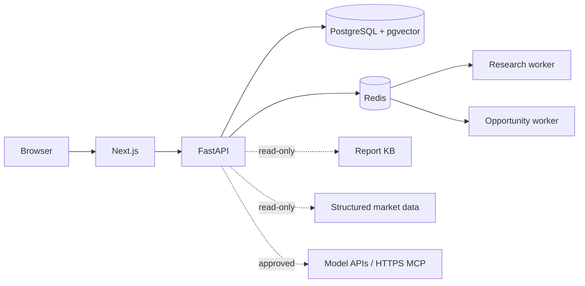

# Architecture

[English](#english) | [中文](#中文)

## English

KeelTrader is a vertical investment Research OS, not a general-purpose autonomous computer agent. The browser exposes one coherent Research Agent while the backend uses bounded, purpose-built services and workers.

### Responsibilities

- Next.js renders the authenticated workspace and proxies browser API calls.
- FastAPI owns authentication, authorization, validation, research APIs, and task submission.
- PostgreSQL is the system of record for users, research runs, evidence, memory, allocations, and audit state.
- Alembic is the only supported schema-management mechanism. Runtime startup never calls `create_all` or ad-hoc bootstrap SQL.
- Redis provides cache, coordination, durable queue references, and worker heartbeats.
- The research worker executes resumable tool-based research runs.
- The opportunity worker materializes bounded snapshots outside request paths.
- Report KB and structured market data are optional read-only integrations.

### Trust boundaries

- Authentication is required by default.
- Every user-owned record is scoped by authenticated user identity.
- BYOK secrets are encrypted at rest and never included in logs, memory, events, or MCP arguments.
- MCP endpoints must use public HTTPS and tools require explicit approval.
- KeelTrader exposes research tools only. It does not offer order execution, arbitrary shell access, or general desktop control.

### Deployment boundary

The public repository contains portable self-hosting definitions and release images. Maintainer domains, host mounts, credentials, observability routes, and rollout manifests belong in a private infrastructure repository.

## 中文

KeelTrader 是垂直投资研究操作系统，不是通用自主电脑 Agent。网页端呈现一个统一 Research Agent，后端使用职责明确、边界受控的服务和 Worker。

- Next.js 提供登录后的研究工作区，并代理浏览器 API 请求。
- FastAPI 负责认证、授权、校验、研究 API 和任务提交。
- PostgreSQL 是用户、研究任务、证据、记忆、配置与审计状态的唯一事实来源。
- Alembic 是唯一支持的数据库结构管理机制；运行时启动不执行 `create_all` 或临时建表 SQL。
- Redis 提供缓存、协调、持久任务引用和 Worker 心跳。
- Research Worker 执行可恢复的工具型研究任务。
- Opportunity Worker 在请求链路外有界物化机会快照。
- 研报库与结构化市场数据是可选的只读集成。

默认要求登录，所有用户数据按身份隔离。BYOK 密钥加密保存，MCP 仅允许公开 HTTPS 且工具需要显式授权。KeelTrader 只暴露研究工具，不提供下单、任意 Shell 或桌面控制。

公共仓库只包含可移植自托管定义和发布镜像；维护者域名、宿主机挂载、凭据、监控路由和发布清单应保存在私有基础设施仓库。
